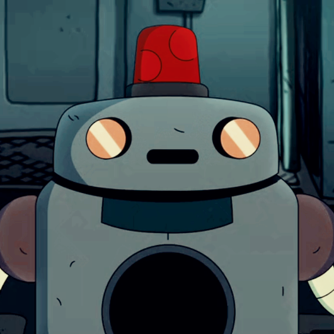

# [Soonaverse](https://soonaverse.com/collection/0x287eb6a8c83a352debe57bf0f3a96f30ff734825) x [Discord](http://chat.tangleswap.exchange): TangleSwap NFT Bot

*Meet H.U.E. — the uber-intelligent AI aboard the Tangleship.*



This bot grants members of a Discord server unique roles depending on the specific NFTs they hold, based on a predefined range of collections.

Users must provide their `DiscordTag` into their Soonaverse profile that is holding the relevant NFT(s).

## Contents

- [Soonaverse x [Discord](http://chat.tangleswap.exchange): TangleSwap NFT Bot](#soonaverse-x-discord-tangleswap-nft-bot)
  - [Contents](#contents)
  - [Project Structure](#project-structure)
  - [Usage](#usage)
    - [Discord Privileges](#discord-privileges)
    - [Deploying to AWS](#deploying-to-aws)
  - [Acknowledgements](#acknowledgements)
  - [License](#license)

## Project Structure

```bash
.
├── LICENSE
├── README.md
├── docs
│   └── HUE.png
├── package-lock.json
├── package.json
├── src
│   ├── config-example.ts
│   ├── main.ts
│   ├── roleManager.ts
│   └── soonaverseApiManager.ts
├── template.yaml
└── tsconfig.json

1 directory, 9 files

```

## Usage

### Discord Privileges

- `Manage Roles`
- The bot owner needs to have 2FA enabled if the server requests it.

### Deploying to AWS

An example setup for the Bot can be deploying to AWS inside a lambda function, scheduled to run once per hour. The schedule frequency can be adjusted accordingly as the functionality for the bot is branched out, as well as built in functionality can be implemented to trigger parts of the bot from API endpoints.

The [Serverless Application Model](https://github.com/aws/serverless-application-model) Command Line Interface (SAM CLI) is an extension of the AWS CLI that adds functionality for building and testing Lambda applications. It uses Docker to run your functions in an Amazon Linux environment that matches Lambda. It can also emulate your application's build environment and API.

To use the SAM CLI, you need the following tools.

- SAM CLI - [Install the SAM CLI](https://docs.aws.amazon.com/serverless-application-model/latest/developerguide/serverless-sam-cli-install.html)
- Node.js - [Install Node.js 16](https://nodejs.org/en/), including the NPM package management tool.
- Docker - [Install Docker community edition](https://hub.docker.com/search/?type=edition&offering=community)

To build and deploy, run the following in your shell:

```bash
sam build --beta-features
# to test the bot locally, NOTE: if credentials are provided in the config file this will run the bot
sam local invoke
# to also deploy after configuring aws credentials
sam deploy --guided
```

## Acknowledgements

Strong inspiration taken from `HerrSkull`: [Soonaverse-NFT-Bot](https://github.com/HerrSkull/Soonaverse-NFT-Bot).

The crew used TypeScript for convenience, and implemented custom logic to adapt the bot's functioning to the specific characteristics of our NFT collection: [*The Big Bang*](https://nft.tangleswap.exchange/).

## License

[MIT](/soonaverse-nft-bot/blob/main/LICENSE)
